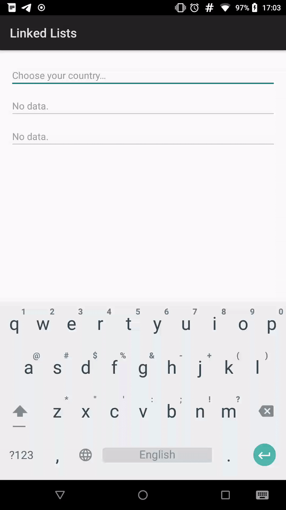

A sample app written using MVVM architecture
with databinding within Kotlin code.

This is an Android version of [Country-State-City dropdown](https://github.com/hiiamrohit/php_ajax_country_state_city_dropdown)
which was initially made for Web.

Using:
* [Kotlin](https://github.com/JetBrains/Kotlin/)
* [Lychee](http://github.com/Miha-x64/Lychee/) for UI, JSON, HTTP, and SQL data binding

Client:
* [Splitties Views DSL](https://github.com/LouisCAD/Splitties/tree/master/modules/views-dsl) for building UI with Kotlin code
* [OkHttp](https://github.com/square/okhttp) to fetch data
* `android.util.JsonReader` to parse JSON
* SQLite to cache data

Server:
* [Undertow](http://undertow.io/) HTTP server
* [Moshi](https://github.com/square/moshi/) to build JSON
* [SQLite-JDBC](https://github.com/xerial/sqlite-jdbc) to store data

